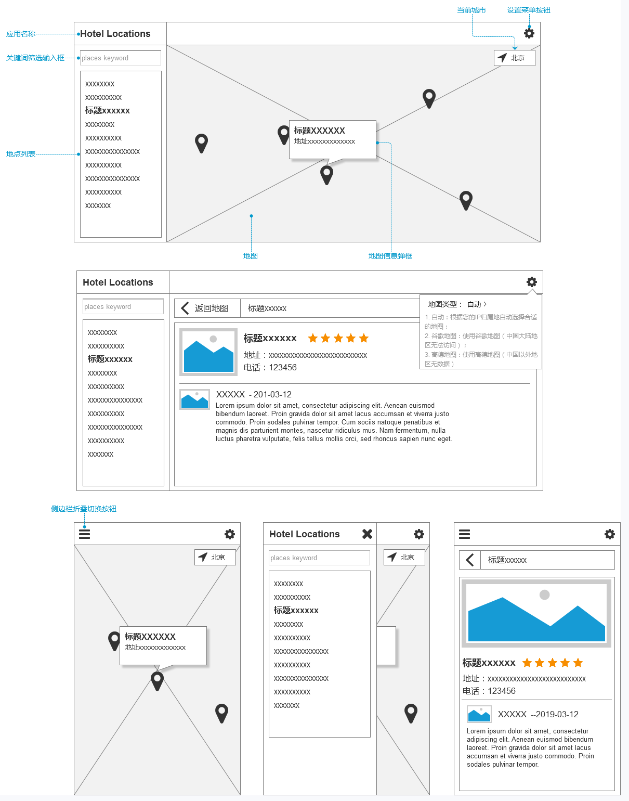
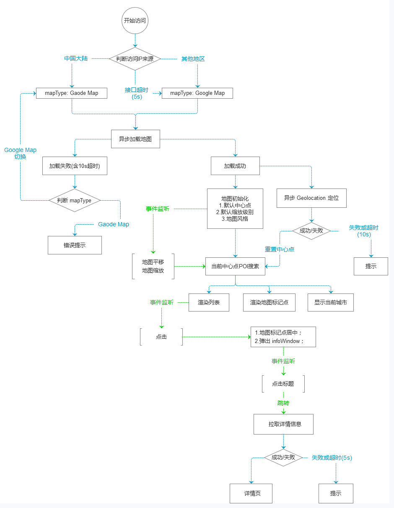

# 功能详述文档 - FSD(Functional Specification Document)

> v1.0

## 应用架构

- ### 技术栈
	- [ReactJS](https://www.reactjs.org/)
	- [Google Maps](https://cloud.google.com/maps-platform/)
	- [Foursquare Places API](https://developer.foursquare.com/places-api)

- ### 可访问性
- ### 边界情况处理
- ### 离线使用

## 界面原型

## 应用功能

- ### 地图展示
    根据当前筛选条件，在地图上标记出对应的位置。

	1. 地图应根据访问者来源
	地图根据访问者的IP来判断，使用谷歌地图或高德地图，
	策略：中国大陆地区使用高德地图，其余地区或国家使用谷歌地图。

- ### 列表展示
- ### 地点过滤
    提供关键词输入文本框，即时匹配关键词过滤列表。

- ### 地点详情
	点击地图标记点后加载POI详情。
	策略：中国大陆地区使用大众点评，其余地区使用Yelp

## 界面逻辑流程

